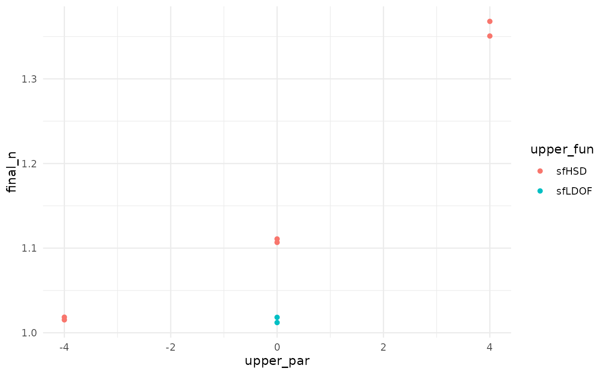

# Getting started: tuning gsDesign()

This vignette shows a minimal, dependency-aware grid search over group
sequential designs created by \[gsDesign::gsDesign()\].

``` r
library(gsDesign)
library(gsDesignTune)
```

## Minimal run

``` r
job <- gsDesignTune(
  k = 3,
  test.type = 2,
  alpha = 0.025,
  beta = 0.10,
  timing = tune_values(list(c(0.33, 0.67, 1), c(0.5, 0.75, 1))),
  upper = SpendingFamily$new(
    SpendingSpec$new(sfLDOF, par = tune_fixed(0)),
    SpendingSpec$new(sfHSD, par = tune_seq(-4, 4, length_out = 3))
  )
)

job$run(strategy = "grid", parallel = FALSE)
res <- job$results()
head(res)
#>   upper_setting       timing upper_fun upper_par config_id status error_message
#> 1  function.... 0.33, 0.....    sfLDOF         0         1     ok          <NA>
#> 2  function.... 0.5, 0.75, 1    sfLDOF         0         2     ok          <NA>
#> 3  function.... 0.33, 0.....     sfHSD        -4         3     ok          <NA>
#> 4  function.... 0.5, 0.75, 1     sfHSD        -4         4     ok          <NA>
#> 5  function.... 0.33, 0.....     sfHSD         0         5     ok          <NA>
#> 6  function.... 0.5, 0.75, 1     sfHSD         0         6     ok          <NA>
#>   warnings                        cache_key design_rds    call_args k test.type
#> 1     <NA> dda98a758aa7d77b22bbaf1dd65cbc0f       <NA> 3, 2, 0..... 3         2
#> 2     <NA> 39d2904e2d8b950a89db2780f6b6d699       <NA> 3, 2, 0..... 3         2
#> 3     <NA> 97911208550ce92d69419a94fd1e0ec2       <NA> 3, 2, 0..... 3         2
#> 4     <NA> 503c551a1cf21057d81659eeb8483e68       <NA> 3, 2, 0..... 3         2
#> 5     <NA> 643deb18024fa01b1de2874e42a9dc66       <NA> 3, 2, 0..... 3         2
#> 6     <NA> ed750dfc7a5411194478dad66288c358       <NA> 3, 2, 0..... 3         2
#>   alpha beta          n_I final_n_I      upper_z      lower_z      upper_p
#> 1 0.025  0.1 0.333977....  1.012053 3.7307, .... -3.7307,.... 1e-04, 0....
#> 2 0.025  0.1 0.509137....  1.018275 2.9626, .... -2.9626,.... 0.0015, ....
#> 3 0.025  0.1 0.335043....  1.015284 3.0162, .... -3.0162,.... 0.0013, ....
#> 4 0.025  0.1 0.509227....  1.018456 2.75, 2..... -2.75, -.... 0.003, 0....
#> 5 0.025  0.1 0.365230....  1.106759 2.3977, .... -2.3977,.... 0.0082, ....
#> 6 0.025  0.1 0.555438....  1.110878 2.2414, .... -2.2414,.... 0.0125, ....
#>        lower_p power           en                               upper_name
#> 1 1e-04, 0....   0.9 1.007862.... Lan-DeMets O'Brien-Fleming approximation
#> 2 0.0015, ....   0.9 1.012586.... Lan-DeMets O'Brien-Fleming approximation
#> 3 0.0013, ....   0.9 1.010154....                        Hwang-Shih-DeCani
#> 4 0.003, 0....   0.9 1.012404....                        Hwang-Shih-DeCani
#> 5 0.0082, ....   0.9 1.088314....                        Hwang-Shih-DeCani
#> 6 0.0125, ....   0.9 1.093520....                        Hwang-Shih-DeCani
#>                                 lower_name bound_summary  final_n    max_n
#> 1 Lan-DeMets O'Brien-Fleming approximation  c("IA 1:.... 1.012053 1.012053
#> 2 Lan-DeMets O'Brien-Fleming approximation  c("IA 1:.... 1.018275 1.018275
#> 3                        Hwang-Shih-DeCani  c("IA 1:.... 1.015284 1.015284
#> 4                        Hwang-Shih-DeCani  c("IA 1:.... 1.018456 1.018456
#> 5                        Hwang-Shih-DeCani  c("IA 1:.... 1.106759 1.106759
#> 6                        Hwang-Shih-DeCani  c("IA 1:.... 1.110878 1.110878
#>   upper_z1 lower_z1
#> 1   3.7307  -3.7307
#> 2   2.9626  -2.9626
#> 3   3.0162  -3.0162
#> 4   2.7500  -2.7500
#> 5   2.3977  -2.3977
#> 6   2.2414  -2.2414
```

## Ranking / filtering

``` r
best <- job$best("final_n", direction = "min")
head(best, 10)
#>   upper_setting       timing upper_fun upper_par config_id status error_message
#> 1  function.... 0.33, 0.....    sfLDOF         0         1     ok          <NA>
#> 3  function.... 0.33, 0.....     sfHSD        -4         3     ok          <NA>
#> 2  function.... 0.5, 0.75, 1    sfLDOF         0         2     ok          <NA>
#> 4  function.... 0.5, 0.75, 1     sfHSD        -4         4     ok          <NA>
#> 5  function.... 0.33, 0.....     sfHSD         0         5     ok          <NA>
#> 6  function.... 0.5, 0.75, 1     sfHSD         0         6     ok          <NA>
#> 8  function.... 0.5, 0.75, 1     sfHSD         4         8     ok          <NA>
#> 7  function.... 0.33, 0.....     sfHSD         4         7     ok          <NA>
#>   warnings                        cache_key design_rds    call_args k test.type
#> 1     <NA> dda98a758aa7d77b22bbaf1dd65cbc0f       <NA> 3, 2, 0..... 3         2
#> 3     <NA> 97911208550ce92d69419a94fd1e0ec2       <NA> 3, 2, 0..... 3         2
#> 2     <NA> 39d2904e2d8b950a89db2780f6b6d699       <NA> 3, 2, 0..... 3         2
#> 4     <NA> 503c551a1cf21057d81659eeb8483e68       <NA> 3, 2, 0..... 3         2
#> 5     <NA> 643deb18024fa01b1de2874e42a9dc66       <NA> 3, 2, 0..... 3         2
#> 6     <NA> ed750dfc7a5411194478dad66288c358       <NA> 3, 2, 0..... 3         2
#> 8     <NA> 7471ab1954c8dc33729d4fb5c7d7138a       <NA> 3, 2, 0..... 3         2
#> 7     <NA> af3ea234a90efd095991e0825ab52274       <NA> 3, 2, 0..... 3         2
#>   alpha beta          n_I final_n_I      upper_z      lower_z      upper_p
#> 1 0.025  0.1 0.333977....  1.012053 3.7307, .... -3.7307,.... 1e-04, 0....
#> 3 0.025  0.1 0.335043....  1.015284 3.0162, .... -3.0162,.... 0.0013, ....
#> 2 0.025  0.1 0.509137....  1.018275 2.9626, .... -2.9626,.... 0.0015, ....
#> 4 0.025  0.1 0.509227....  1.018456 2.75, 2..... -2.75, -.... 0.003, 0....
#> 5 0.025  0.1 0.365230....  1.106759 2.3977, .... -2.3977,.... 0.0082, ....
#> 6 0.025  0.1 0.555438....  1.110878 2.2414, .... -2.2414,.... 0.0125, ....
#> 8 0.025  0.1 0.675309....  1.350620 2.0137, .... -2.0137,.... 0.022, 0....
#> 7 0.025  0.1 0.451412....  1.367918 2.0822, .... -2.0822,.... 0.0187, ....
#>        lower_p power           en                               upper_name
#> 1 1e-04, 0....   0.9 1.007862.... Lan-DeMets O'Brien-Fleming approximation
#> 3 0.0013, ....   0.9 1.010154....                        Hwang-Shih-DeCani
#> 2 0.0015, ....   0.9 1.012586.... Lan-DeMets O'Brien-Fleming approximation
#> 4 0.003, 0....   0.9 1.012404....                        Hwang-Shih-DeCani
#> 5 0.0082, ....   0.9 1.088314....                        Hwang-Shih-DeCani
#> 6 0.0125, ....   0.9 1.093520....                        Hwang-Shih-DeCani
#> 8 0.022, 0....   0.9 1.319407....                        Hwang-Shih-DeCani
#> 7 0.0187, ....   0.9 1.329142....                        Hwang-Shih-DeCani
#>                                 lower_name bound_summary  final_n    max_n
#> 1 Lan-DeMets O'Brien-Fleming approximation  c("IA 1:.... 1.012053 1.012053
#> 3                        Hwang-Shih-DeCani  c("IA 1:.... 1.015284 1.015284
#> 2 Lan-DeMets O'Brien-Fleming approximation  c("IA 1:.... 1.018275 1.018275
#> 4                        Hwang-Shih-DeCani  c("IA 1:.... 1.018456 1.018456
#> 5                        Hwang-Shih-DeCani  c("IA 1:.... 1.106759 1.106759
#> 6                        Hwang-Shih-DeCani  c("IA 1:.... 1.110878 1.110878
#> 8                        Hwang-Shih-DeCani  c("IA 1:.... 1.350620 1.350620
#> 7                        Hwang-Shih-DeCani  c("IA 1:.... 1.367918 1.367918
#>   upper_z1 lower_z1
#> 1   3.7307  -3.7307
#> 3   3.0162  -3.0162
#> 2   2.9626  -2.9626
#> 4   2.7500  -2.7500
#> 5   2.3977  -2.3977
#> 6   2.2414  -2.2414
#> 8   2.0137  -2.0137
#> 7   2.0822  -2.0822
```

## Plot

``` r
if (requireNamespace("ggplot2", quietly = TRUE)) {
  job$plot(metric = "final_n", x = "upper_par", color = "upper_fun")
}
#> Warning: `aes_string()` was deprecated in ggplot2 3.0.0.
#> ℹ Please use tidy evaluation idioms with `aes()`.
#> ℹ See also `vignette("ggplot2-in-packages")` for more information.
#> ℹ The deprecated feature was likely used in the gsDesignTune package.
#>   Please report the issue to the authors.
#> This warning is displayed once per session.
#> Call `lifecycle::last_lifecycle_warnings()` to see where this warning was
#> generated.
```



## Export a report

``` r
report_path <- tempfile(fileext = ".html")
job$report(report_path)
report_path
#> [1] "/tmp/RtmpsBxxmO/file1dd18527bb9.html"
```
