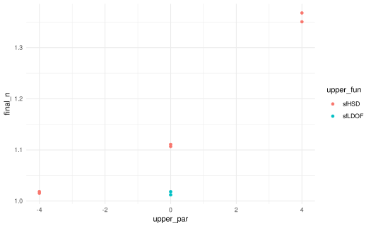
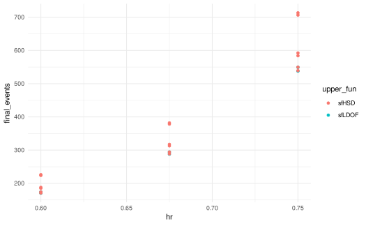

# Getting started with gsDesignTune

This vignette demonstrates dependency-aware grid search over group
sequential designs using gsDesignTune.

``` r
library(gsDesign)
library(gsDesignTune)
```

## Basic designs with `gsDesignTune()`

[`gsDesignTune()`](https://nanx.me/gsDesignTune/reference/gsDesignTune.md)
wraps
[`gsDesign::gsDesign()`](https://keaven.github.io/gsDesign/reference/gsDesign.html)
for tuning basic group sequential designs.

``` r
job <- gsDesignTune(
  k = 3,
  test.type = 2,
  alpha = 0.025,
  beta = 0.10,
  timing = tune_values(list(c(0.33, 0.67, 1), c(0.5, 0.75, 1))),
  upper = SpendingFamily$new(
    SpendingSpec$new(sfLDOF, par = tune_fixed(0)),
    SpendingSpec$new(sfHSD, par = tune_seq(-4, 4, length_out = 3))
  )
)

job$run(strategy = "grid", parallel = FALSE)
res <- job$results()
job$table(n = 6)
```

| Config ID | Upper bound | Upper parameter | Timing        | Final N | Power | Upper Z (IA1) | Lower Z (IA1) |
|-----------|-------------|-----------------|---------------|---------|-------|---------------|---------------|
| 1         | sfLDOF      | 0               | 0.33, 0.67, 1 | 1.01    | 0.9   | 3.73          | -3.73         |
| 2         | sfLDOF      | 0               | 0.5, 0.75, 1  | 1.02    | 0.9   | 2.96          | -2.96         |
| 3         | sfHSD       | -4              | 0.33, 0.67, 1 | 1.02    | 0.9   | 3.02          | -3.02         |
| 4         | sfHSD       | -4              | 0.5, 0.75, 1  | 1.02    | 0.9   | 2.75          | -2.75         |
| 5         | sfHSD       | 0               | 0.33, 0.67, 1 | 1.11    | 0.9   | 2.4           | -2.4          |
| 6         | sfHSD       | 0               | 0.5, 0.75, 1  | 1.11    | 0.9   | 2.24          | -2.24         |

### Ranking and filtering

``` r
best <- job$best("final_n", direction = "min")
job$table(best, n = 10)
```

| Config ID | Upper bound | Upper parameter | Timing        | Final N | Power | Upper Z (IA1) | Lower Z (IA1) |
|-----------|-------------|-----------------|---------------|---------|-------|---------------|---------------|
| 1         | sfLDOF      | 0               | 0.33, 0.67, 1 | 1.01    | 0.9   | 3.73          | -3.73         |
| 3         | sfHSD       | -4              | 0.33, 0.67, 1 | 1.02    | 0.9   | 3.02          | -3.02         |
| 2         | sfLDOF      | 0               | 0.5, 0.75, 1  | 1.02    | 0.9   | 2.96          | -2.96         |
| 4         | sfHSD       | -4              | 0.5, 0.75, 1  | 1.02    | 0.9   | 2.75          | -2.75         |
| 5         | sfHSD       | 0               | 0.33, 0.67, 1 | 1.11    | 0.9   | 2.4           | -2.4          |
| 6         | sfHSD       | 0               | 0.5, 0.75, 1  | 1.11    | 0.9   | 2.24          | -2.24         |
| 8         | sfHSD       | 4               | 0.5, 0.75, 1  | 1.35    | 0.9   | 2.01          | -2.01         |
| 7         | sfHSD       | 4               | 0.33, 0.67, 1 | 1.37    | 0.9   | 2.08          | -2.08         |

### Plot

``` r
job$plot(metric = "final_n", x = "upper_par", color = "upper_fun")
```



## Survival designs with `gsSurvTune()`

[`gsSurvTune()`](https://nanx.me/gsDesignTune/reference/gsSurvTune.md)
wraps
[`gsDesign::gsSurv()`](https://keaven.github.io/gsDesign/reference/nSurv.html)
for tuning time-to-event designs.

``` r
job_surv <- gsSurvTune(
  k = 3,
  test.type = 4,
  alpha = 0.025,
  beta = 0.10,
  timing = tune_values(list(c(0.33, 0.67, 1), c(0.5, 0.75, 1))),
  hr = tune_seq(0.60, 0.75, length_out = 3),
  upper = SpendingFamily$new(
    SpendingSpec$new(sfLDOF, par = tune_fixed(0)),
    SpendingSpec$new(sfHSD, par = tune_seq(-4, 4, length_out = 3))
  ),
  lower = SpendingSpec$new(sfLDOF, par = tune_fixed(0)),
  lambdaC = log(2) / 6,
  eta = 0.01,
  gamma = c(2.5, 5, 7.5, 10),
  R = c(2, 2, 2, 6),
  T = 18,
  minfup = 6,
  ratio = 1
)

job_surv$run(strategy = "grid", parallel = FALSE)
res_surv <- job_surv$results()
job_surv$table(n = 6)
```

| Config ID | Upper bound | Upper parameter | Timing        | HR    | Final events | Final total N | Power | Upper Z (IA1) | Lower Z (IA1) |
|-----------|-------------|-----------------|---------------|-------|--------------|---------------|-------|---------------|---------------|
| 1         | sfLDOF      | 0               | 0.33, 0.67, 1 | 0.6   | 170          | 296           | 0.9   | 3.73          | -0.719        |
| 2         | sfLDOF      | 0               | 0.33, 0.67, 1 | 0.675 | 288          | 482           | 0.9   | 3.73          | -0.719        |
| 3         | sfLDOF      | 0               | 0.33, 0.67, 1 | 0.75  | 538          | 874           | 0.9   | 3.73          | -0.719        |
| 4         | sfLDOF      | 0               | 0.5, 0.75, 1  | 0.6   | 174          | 302           | 0.9   | 2.96          | 0.332         |
| 5         | sfLDOF      | 0               | 0.5, 0.75, 1  | 0.675 | 294          | 492           | 0.9   | 2.96          | 0.332         |
| 6         | sfLDOF      | 0               | 0.5, 0.75, 1  | 0.75  | 549          | 892           | 0.9   | 2.96          | 0.332         |

### Calendar-timed analyses with `gsSurvCalendarTune()`

[`gsSurvCalendarTune()`](https://nanx.me/gsDesignTune/reference/gsSurvCalendarTune.md)
is similar to
[`gsSurvTune()`](https://nanx.me/gsDesignTune/reference/gsSurvTune.md),
but you specify planned calendar times of analyses via `calendarTime`
instead of information timing.

``` r
job_cal <- gsSurvCalendarTune(
  test.type = 4,
  alpha = 0.025,
  beta = 0.10,
  calendarTime = tune_values(list(c(12, 24, 36), c(9, 18, 27))),
  spending = tune_choice("information", "calendar"),
  hr = tune_seq(0.60, 0.75, length_out = 3),
  upper = SpendingFamily$new(
    SpendingSpec$new(sfLDOF, par = tune_fixed(0)),
    SpendingSpec$new(sfHSD, par = tune_seq(-4, 4, length_out = 3))
  ),
  lower = SpendingSpec$new(sfLDOF, par = tune_fixed(0)),
  lambdaC = log(2) / 6,
  eta = 0.01,
  gamma = c(2.5, 5, 7.5, 10),
  R = c(2, 2, 2, 6),
  minfup = 18,
  ratio = 1
)

job_cal$run(strategy = "grid", parallel = FALSE)
res_cal <- job_cal$results()
job_cal$table(n = 6)
```

| Config ID | Upper bound | Upper parameter | Calendar time | Spending    | HR    | Final events | Final total N | Power | Upper Z (IA1) | Lower Z (IA1) |
|-----------|-------------|-----------------|---------------|-------------|-------|--------------|---------------|-------|---------------|---------------|
| 1         | sfLDOF      | 0               | 12, 24, 36    | information | 0.6   | 173          | 212           | 0.9   | 4.48          | -1.565        |
| 2         | sfLDOF      | 0               | 12, 24, 36    | information | 0.675 | 293          | 354           | 0.9   | 4.44          | -1.516        |
| 3         | sfLDOF      | 0               | 12, 24, 36    | information | 0.75  | 549          | 650           | 0.9   | 4.39          | -1.467        |
| 4         | sfLDOF      | 0               | 12, 24, 36    | calendar    | 0.6   | 165          | 204           | 0.9   | 3.71          | -1.023        |
| 5         | sfLDOF      | 0               | 12, 24, 36    | calendar    | 0.675 | 279          | 336           | 0.9   | 3.71          | -1.01         |
| 6         | sfLDOF      | 0               | 12, 24, 36    | calendar    | 0.75  | 522          | 618           | 0.9   | 3.71          | -0.996        |

### Multi-scenario exploration

``` r
best_surv <- job_surv$best("final_events", direction = "min")
job_surv$table(best_surv, n = 10)
```

| Config ID | Upper bound | Upper parameter | Timing        | HR    | Final events | Final total N | Power | Upper Z (IA1) | Lower Z (IA1) |
|-----------|-------------|-----------------|---------------|-------|--------------|---------------|-------|---------------|---------------|
| 1         | sfLDOF      | 0               | 0.33, 0.67, 1 | 0.6   | 170          | 296           | 0.9   | 3.73          | -0.719        |
| 7         | sfHSD       | -4              | 0.33, 0.67, 1 | 0.6   | 171          | 296           | 0.9   | 3.02          | -0.716        |
| 4         | sfLDOF      | 0               | 0.5, 0.75, 1  | 0.6   | 174          | 302           | 0.9   | 2.96          | 0.332         |
| 10        | sfHSD       | -4              | 0.5, 0.75, 1  | 0.6   | 174          | 302           | 0.9   | 2.75          | 0.332         |
| 13        | sfHSD       | 0               | 0.33, 0.67, 1 | 0.6   | 185          | 320           | 0.9   | 2.4           | -0.638        |
| 16        | sfHSD       | 0               | 0.5, 0.75, 1  | 0.6   | 188          | 326           | 0.9   | 2.24          | 0.423         |
| 22        | sfHSD       | 4               | 0.5, 0.75, 1  | 0.6   | 224          | 388           | 0.9   | 2.01          | 0.651         |
| 19        | sfHSD       | 4               | 0.33, 0.67, 1 | 0.6   | 226          | 392           | 0.9   | 2.08          | -0.428        |
| 2         | sfLDOF      | 0               | 0.33, 0.67, 1 | 0.675 | 288          | 482           | 0.9   | 3.73          | -0.719        |
| 8         | sfHSD       | -4              | 0.33, 0.67, 1 | 0.675 | 289          | 484           | 0.9   | 3.02          | -0.716        |

``` r
job_surv$plot(metric = "final_events", x = "hr", color = "upper_fun")
```



## Export a report

``` r
report_path <- tempfile(fileext = ".html")
job_surv$report(report_path)
report_path
#> [1] "/tmp/RtmpSDoSXC/file1c1a78427626.html"
```
