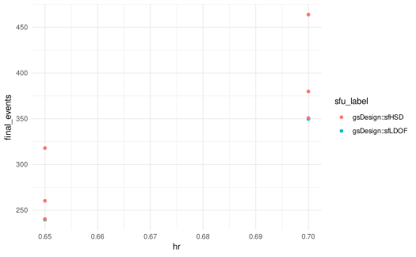

# Spending functions and dependent parameters

gsDesignTune provides two ways to handle dependencies between spending
functions and their parameters:

1.  Preferred: use `upper = SpendingSpec/SpendingFamily` and
    `lower = ...`.
2.  Advanced: use
    [`tune_dep()`](https://nanx.me/gsDesignTune/reference/tune_dep.md)
    to express dependencies between any arguments.

``` r
library(gsDesign)
library(gsDesignTune)
```

## Preferred UX: `SpendingFamily`

``` r
job1 <- gsSurvTune(
  k = 3,
  test.type = 4,
  alpha = 0.025,
  beta = 0.10,
  timing = c(0.33, 0.67, 1),
  hr = tune_values(list(0.65, 0.70)),
  upper = SpendingFamily$new(
    SpendingSpec$new(sfLDOF, par = tune_fixed(0)),
    SpendingSpec$new(sfHSD, par = tune_seq(-4, 4, length_out = 3))
  ),
  lower = SpendingSpec$new(sfLDOF, par = tune_fixed(0)),
  lambdaC = log(2) / 6,
  eta = 0.01,
  gamma = c(2.5, 5, 7.5, 10),
  R = c(2, 2, 2, 6),
  T = 18,
  minfup = 6,
  ratio = 1
)

job1$run(strategy = "grid", parallel = FALSE)
res1 <- job1$results()
job1$table(columns = c("hr", "upper_fun", "upper_par", "final_events"), n = 6)
```

| HR   | Upper bound | Upper parameter | Final events |
|------|-------------|-----------------|--------------|
| 0.65 | sfLDOF      | 0               | 240          |
| 0.7  | sfLDOF      | 0               | 350          |
| 0.65 | sfHSD       | -4              | 240          |
| 0.7  | sfHSD       | -4              | 351          |
| 0.65 | sfHSD       | 0               | 260          |
| 0.7  | sfHSD       | 0               | 380          |

## Advanced: `tune_dep()`

``` r
job2 <- gsSurvTune(
  k = 3,
  test.type = 4,
  alpha = 0.025,
  beta = 0.10,
  timing = c(0.33, 0.67, 1),
  hr = tune_values(list(0.65, 0.70)),
  sfu = tune_choice(sfLDOF, sfHSD),
  sfupar = tune_dep(
    depends_on = "sfu",
    map = function(sfu) {
      if (identical(sfu, sfLDOF)) tune_fixed(0) else tune_seq(-4, 4, length_out = 3)
    }
  ),
  sfl = sfLDOF,
  sflpar = 0,
  lambdaC = log(2) / 6,
  eta = 0.01,
  gamma = c(2.5, 5, 7.5, 10),
  R = c(2, 2, 2, 6),
  T = 18,
  minfup = 6,
  ratio = 1
)

job2$run(strategy = "grid", parallel = FALSE)
res2 <- job2$results()
job2$table(columns = c("hr", "sfu", "sfupar", "final_events"), n = 6)
```

| HR   | Sfu              | Sfupar | Final events |
|------|------------------|--------|--------------|
| 0.65 | gsDesign::sfLDOF | 0      | 240          |
| 0.65 | gsDesign::sfHSD  | -4     | 240          |
| 0.65 | gsDesign::sfHSD  | 0      | 260          |
| 0.65 | gsDesign::sfHSD  | 4      | 318          |
| 0.7  | gsDesign::sfLDOF | 0      | 350          |
| 0.7  | gsDesign::sfHSD  | -4     | 351          |

``` r
job2$plot(metric = "final_events", x = "hr", color = "sfu")
```



## Export a report

``` r
report_path <- tempfile(fileext = ".html")
job2$report(report_path)
report_path
#> [1] "/tmp/Rtmpz3sAha/file1c98118dd014.html"
```
