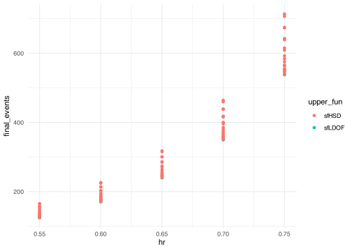

# gsDesignTune

Enables systematic, dependency-aware scenario exploration for group
sequential designs created by gsDesign. gsDesignTune is built for
**design space evaluation** (ranking, filtering, Pareto trade-offs)
rather than claiming a single “optimal design”. With a focus on user
experience, correctness, and speed, it supports off-the-shelf parallel
processing with progress tracking, caching, and reproducible reporting.

## Installation

You can install the development version of gsDesignTune from GitHub
with:

``` r
# install.packages("pak")
pak::pak("nanxstats/gsDesignTune")
```

## Features

- Drop-in workflow: replace
  [`gsDesign()`](https://keaven.github.io/gsDesign/reference/gsDesign.html)/[`gsSurv()`](https://keaven.github.io/gsDesign/reference/nSurv.html)/[`gsSurvCalendar()`](https://keaven.github.io/gsDesign/reference/gsSurvCalendar.html)
  with
  [`gsDesignTune()`](https://nanx.me/gsDesignTune/reference/gsDesignTune.md)/[`gsSurvTune()`](https://nanx.me/gsDesignTune/reference/gsSurvTune.md)/[`gsSurvCalendarTune()`](https://nanx.me/gsDesignTune/reference/gsSurvCalendarTune.md),
  then `$run()`.
- Dependency-aware tuning: express design parameter dependency
  relationships precisely, for example, spending functions and their
  spending parameters.
- Grid and random search over candidate sets, with vector-valued
  arguments treated atomically.
- Parallel evaluation via {future} / {future.apply} with progress via
  {progressr}. Use any {future} backend that fits your infrastructure.
- Reproducible and auditable results: per-configuration warnings/errors
  and reconstructable underlying call.
- Optional caching of design objects to disk and HTML reporting via
  {rmarkdown}.

## Quick start

Evaluate time-to-event designs:

``` r
library(gsDesign)
library(gsDesignTune)
library(future)

plan(multisession, workers = 2)

job <- gsSurvTune(
  k = 3,
  test.type = 4,
  alpha = 0.025,
  beta = 0.10,
  timing = tune_values(list(c(0.33, 0.67, 1), c(0.5, 0.75, 1))),
  hr = tune_seq(0.55, 0.75, length_out = 5),
  upper = SpendingFamily$new(
    SpendingSpec$new(sfLDOF, par = tune_fixed(0)),
    SpendingSpec$new(sfHSD, par = tune_seq(-4, 4, length_out = 9))
  ),
  lower = SpendingSpec$new(sfLDOF, par = tune_fixed(0)),
  lambdaC = log(2) / 6,
  eta = 0.01,
  gamma = c(2.5, 5, 7.5, 10),
  R = c(2, 2, 2, 6),
  T = 18,
  minfup = 6,
  ratio = 1
)

job$run(strategy = "grid", parallel = TRUE, seed = 1, cache_dir = "gstune_cache")

res <- job$results()

job$table(n = 10)
```

| **Config ID** | **Upper bound** | **Upper parameter** | **Timing**    | **HR** | **Final events** | **Final total N** | **Power** | **Upper Z (IA1)** | **Lower Z (IA1)** |
|---------------|-----------------|---------------------|---------------|--------|------------------|-------------------|-----------|-------------------|-------------------|
| 1             | sfLDOF          | 0                   | 0.33, 0.67, 1 | 0.55   | 124              | 222               | 0.9       | 3.73              | -0.719            |
| 2             | sfLDOF          | 0                   | 0.33, 0.67, 1 | 0.6    | 170              | 296               | 0.9       | 3.73              | -0.719            |
| 3             | sfLDOF          | 0                   | 0.33, 0.67, 1 | 0.65   | 240              | 406               | 0.9       | 3.73              | -0.719            |
| 4             | sfLDOF          | 0                   | 0.33, 0.67, 1 | 0.7    | 350              | 580               | 0.9       | 3.73              | -0.719            |
| 5             | sfLDOF          | 0                   | 0.33, 0.67, 1 | 0.75   | 538              | 874               | 0.9       | 3.73              | -0.719            |
| 6             | sfLDOF          | 0                   | 0.5, 0.75, 1  | 0.55   | 127              | 226               | 0.9       | 2.96              | 0.332             |
| 7             | sfLDOF          | 0                   | 0.5, 0.75, 1  | 0.6    | 174              | 302               | 0.9       | 2.96              | 0.332             |
| 8             | sfLDOF          | 0                   | 0.5, 0.75, 1  | 0.65   | 245              | 414               | 0.9       | 2.96              | 0.332             |
| 9             | sfLDOF          | 0                   | 0.5, 0.75, 1  | 0.7    | 357              | 592               | 0.9       | 2.96              | 0.332             |
| 10            | sfLDOF          | 0                   | 0.5, 0.75, 1  | 0.75   | 549              | 892               | 0.9       | 2.96              | 0.332             |

``` r
job$best("final_events", direction = "min") |>
  job$table(n = 10)
```

| **Config ID** | **Upper bound** | **Upper parameter** | **Timing**    | **HR** | **Final events** | **Final total N** | **Power** | **Upper Z (IA1)** | **Lower Z (IA1)** |
|---------------|-----------------|---------------------|---------------|--------|------------------|-------------------|-----------|-------------------|-------------------|
| 1             | sfLDOF          | 0                   | 0.33, 0.67, 1 | 0.55   | 124              | 222               | 0.9       | 3.73              | -0.719            |
| 11            | sfHSD           | -4                  | 0.33, 0.67, 1 | 0.55   | 125              | 222               | 0.9       | 3.02              | -0.716            |
| 21            | sfHSD           | -3                  | 0.33, 0.67, 1 | 0.55   | 126              | 224               | 0.9       | 2.85              | -0.707            |
| 6             | sfLDOF          | 0                   | 0.5, 0.75, 1  | 0.55   | 127              | 226               | 0.9       | 2.96              | 0.332             |
| 16            | sfHSD           | -4                  | 0.5, 0.75, 1  | 0.55   | 127              | 226               | 0.9       | 2.75              | 0.332             |
| 31            | sfHSD           | -2                  | 0.33, 0.67, 1 | 0.55   | 128              | 228               | 0.9       | 2.68              | -0.692            |
| 26            | sfHSD           | -3                  | 0.5, 0.75, 1  | 0.55   | 128              | 228               | 0.9       | 2.61              | 0.344             |
| 36            | sfHSD           | -2                  | 0.5, 0.75, 1  | 0.55   | 130              | 232               | 0.9       | 2.47              | 0.361             |
| 41            | sfHSD           | -1                  | 0.33, 0.67, 1 | 0.55   | 131              | 232               | 0.9       | 2.53              | -0.67             |
| 46            | sfHSD           | -1                  | 0.5, 0.75, 1  | 0.55   | 133              | 236               | 0.9       | 2.35              | 0.387             |

``` r
job$pareto(
  metrics = c("final_events", "upper_z1"),
  directions = c("min", "min")
) |> job$table(n = 10)
```

| **Config ID** | **Upper bound** | **Upper parameter** | **Timing**    | **Final events** | **Final total N** | **Power** | **Upper Z (IA1)** | **Lower Z (IA1)** |
|---------------|-----------------|---------------------|---------------|------------------|-------------------|-----------|-------------------|-------------------|
| 1             | sfLDOF          | 0                   | 0.33, 0.67, 1 | 124              | 222               | 0.9       | 3.73              | -0.719            |
| 11            | sfHSD           | -4                  | 0.33, 0.67, 1 | 125              | 222               | 0.9       | 3.02              | -0.716            |
| 16            | sfHSD           | -4                  | 0.5, 0.75, 1  | 127              | 226               | 0.9       | 2.75              | 0.332             |
| 21            | sfHSD           | -3                  | 0.33, 0.67, 1 | 126              | 224               | 0.9       | 2.85              | -0.707            |
| 26            | sfHSD           | -3                  | 0.5, 0.75, 1  | 128              | 228               | 0.9       | 2.61              | 0.344             |
| 31            | sfHSD           | -2                  | 0.33, 0.67, 1 | 128              | 228               | 0.9       | 2.68              | -0.692            |
| 36            | sfHSD           | -2                  | 0.5, 0.75, 1  | 130              | 232               | 0.9       | 2.47              | 0.361             |
| 46            | sfHSD           | -1                  | 0.5, 0.75, 1  | 133              | 236               | 0.9       | 2.35              | 0.387             |
| 56            | sfHSD           | 0                   | 0.5, 0.75, 1  | 137              | 244               | 0.9       | 2.24              | 0.423             |
| 66            | sfHSD           | 1                   | 0.5, 0.75, 1  | 142              | 254               | 0.9       | 2.16              | 0.47              |

``` r
job$plot(metric = "final_events", x = "hr", color = "upper_fun")
```



``` r
job$report("gstune_report.html")
```

## Tune specifications

- `tune_fixed(x)`: explicit fixed value (useful inside dependencies)
- `tune_values(list(...))`: explicit candidates (supports vector-valued
  candidates)
- `tune_seq(from, to, length_out)`, `tune_int(from, to, by)`
- `tune_choice(...)`: categorical choices
- `tune_dep(depends_on, map)`: dependent mapping for any argument

See vignettes for end-to-end examples, spending function tuning, and
parallel + reproducible reporting.
